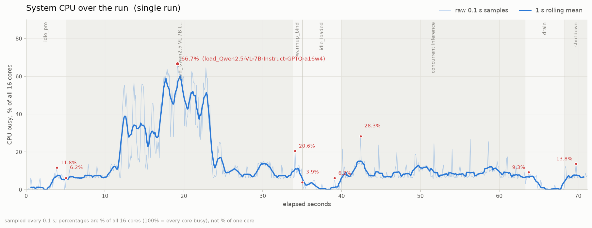
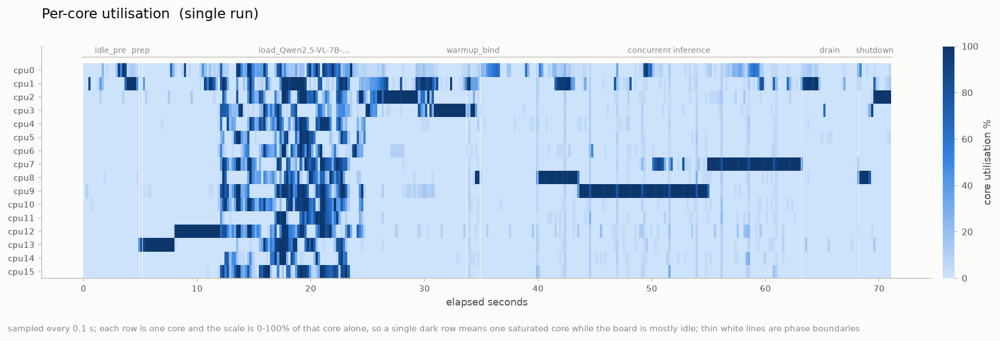

# genai-cpu-util

Measures CPU usage on a SiMa Modalix DevKit while a Neat `GenAIServer` serves
several models at once, then prompted **in parallel**, one request thread per model so every model has a request in flight at the same time. Split into initialization, inference and peak. Any number of models works, in any mix of VLM and LLM.

## Example

Qwen2.5-VL-7B and Qwen3-4B in one server, prompted concurrently — 3 runs x 10
prompts per model:







## Install

On the DevKit, install into the venv that already has `pyneat`.

```bash
pip install -e .
```

## Use

```bash
M=/media/nvme/llima/models

# two models in one server, prompted at the same time
genai-cpu-benchmark $M/Qwen2.5-VL-7B-Instruct-GPTQ-a16w4 $M/Qwen3-4B-Instruct-2507-GPTQ-a16w4

# three reloads, twenty prompts each -- the useful shape
genai-cpu-benchmark $M/Qwen2.5-VL-7B-Instruct-GPTQ-a16w4 $M/Qwen3-4B-Instruct-2507-GPTQ-a16w4 \
    --repeat 3 --prompts 20 --name benchmark-name
```

Each run gets its own report directory, named by timestamp unless `--name` says
otherwise, and the charts are written into it when the run finishes.

`--repeat N` reloads the models N times. `--prompts M` loops the requests M times inside one run

`genai-cpu-benchmark --help` lists everything else

## Output

Everything lands under `reports/<name>/`, where `<name>` is `--name` or a
timestamp. An absolute `--name` is used as given instead.

```
reports/20260721-151403/
├── cpu.csv      one row per sample: timestamp, /proc/stat totals, per-core busy/total
├── marks.csv    phase boundaries: timestamp, phase name
├── timeline.png
└── cores.png
```

## How it works

`sampler.py` samples `/proc/stat` in a separate process while `benchmark.py`
drives the server and stamps a phase boundary at every step — idle baseline,
per-model load, warmup, loaded idle, inference, shutdown. `charts.py` slices the
samples by phase into `timeline.png` (CPU over the run, phases banded, peaks
marked) and `cores.png` (per-core heatmap, showing whether load is spread or
stuck on one core).

## Models used for the reference measurements

- https://huggingface.co/simaai/Qwen2.5-VL-7B-Instruct-GPTQ-a16w4
- https://huggingface.co/simaai/Qwen3-4B-Instruct-2507-GPTQ-a16w4
